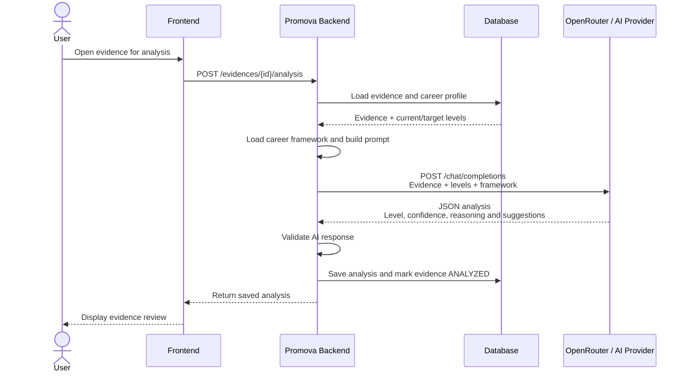

# Promova

Promova é um protótipo para captura e análise de evidências de carreira, com backend em Java/Spring Boot e frontend leve em JavaScript.

A aplicação captura evidências de fontes conectadas, transforma essas informações em sinais de carreira revisáveis e envia o conteúdo para o fluxo de análise do backend.

## Estrutura do Projeto

```text
.
├── backend/          API Spring Boot, fluxo de análise e integração com GitHub
├── frontend/         Módulos da interface e funcionalidades do frontend
├── scripts/          Scripts locais de build, dev e lint do frontend
├── app.js            Bootstrap do frontend
├── index.html        HTML de entrada do frontend
└── styles.css        Estilos compartilhados do frontend
```

O output gerado do frontend fica em `dist/` e não deve ser versionado.

## Requisitos

- Java 21
- Node.js 20+
- Opcional: `GITHUB_TOKEN` para repositórios privados ou limites maiores na API do GitHub
- Opcional: `OPENROUTER_API_KEY` para habilitar análise real com LLM via OpenRouter

## Como Rodar Localmente

Inicie o backend:

```powershell
cd backend
.\gradlew.bat bootRun
```

Em outro terminal, inicie o frontend:

```powershell
npm run dev
```

O frontend inicia em `http://localhost:4173`, a menos que a porta já esteja em uso. Nesse caso, o servidor local tenta as próximas portas automaticamente.

## Habilitar Análise com IA

Por padrão, o backend usa o motor mock para permitir desenvolvimento local e CI sem depender de chave externa.

Para usar análise real via OpenRouter:

```powershell
cd backend
$env:PROMOVA_ANALYSIS_ENGINE="openrouter"
$env:OPENROUTER_API_KEY="sua-chave"
.\gradlew.bat bootRun
```

O modelo padrão é:

```text
meta-llama/llama-3.3-70b-instruct:free
```

Você pode trocar o modelo com:

```powershell
$env:OPENROUTER_MODEL="qwen/qwen3-next-80b-a3b-instruct:free"
```

## Fluxo da Análise com IA



O request ao AI provider acontece quando `PROMOVA_ANALYSIS_ENGINE=openrouter`. O mock existe apenas nos perfis `dev` e `test`; produção força OpenRouter e falha na inicialização sem `OPENROUTER_API_KEY`. Evidência de origem e observação opcional do funcionário são enviadas em campos separados. O diagrama também está disponível em [`docs/evidence-ai-analysis-flow.md`](docs/evidence-ai-analysis-flow.md).

## Editar o Career Framework

O framework atual fica em:

[backend/src/main/resources/career-framework.json](</C:/Users/João/Documents/Projects/FIAP/Startup/backend/src/main/resources/career-framework.json>)

Hoje ele contém:

```json
{
  "levels": {
    "L3": {
      "title": "Software Engineer I",
      "description": "Software Engineer I",
      "criteria": {
        "Writing code": "With guidance and support from more senior engineers...",
        "Testing": "Understands the basics about the test pyramid."
      }
    },
    "L4": {
      "title": "Software Engineer II",
      "description": "Software Engineer II",
      "criteria": {
        "Writing code": "Consistently writes code that is easily testable...",
        "Testing": "Understands all levels of testing in the testing pyramid."
      }
    }
  }
}
```

Para usar outro arquivo sem alterar o repo:

```powershell
$env:PROMOVA_FRAMEWORK_PATH="file:C:/caminho/para/career-framework.json"
```

## Validações

Frontend:

```powershell
npm run check
```

Regressão E2E de sessão (inicia backend e frontend locais, usa Chrome e um banco H2 temporário):

```powershell
npm install
npm run test:e2e
```

No macOS, o teste usa o Google Chrome em `/Applications` por padrão. Em outros ambientes,
defina `PROMOVA_E2E_CHROME` com o caminho do executável de Chrome/Chromium. As portas padrão
são `14173` (frontend) e `18080` (backend), configuráveis por `PROMOVA_E2E_FRONTEND_PORT` e
`PROMOVA_E2E_BACKEND_PORT`. O teste cobre reload de gestor e funcionário, navegação direta ao
perfil, persistência da sessão após reinício do backend e rejeição de token inválido.

As rotas autenticadas usam URLs como `/dashboard`, `/profile` e `/manager`. O servidor local já
faz fallback dessas rotas para `index.html`; o servidor estático de produção deve aplicar o mesmo
fallback de SPA para que a navegação direta funcione.

Backend:

```powershell
cd backend
.\gradlew.bat testClasses
.\gradlew.bat bootJar
```

## API do Backend

Endpoints principais:

```text
GET  /evidences?status=PENDING
GET  /evidences/{evidenceId}
POST /evidences/{evidenceId}/analysis
GET  /evidences/github/pull-request?repo=owner/repo&pullNumber=123
```

A analise e solicitada pelo endpoint autenticado `POST /evidences/{evidenceId}/analysis`, sem
corpo de requisicao. O servidor carrega a Evidence PENDING pertencente ao usuario autenticado,
o perfil e o career framework, executa o engine e persiste o resultado. A evidencia, os niveis e a
classificacao nao sao enviados nem definidos pelo navegador.

Configuração de carreira e terminologia:

```text
GET  /career-configuration
GET  /manager/settings
PUT  /manager/settings/terminology
GET  /manager/settings/job-roles?includeArchived=true
POST /manager/settings/job-roles
PUT  /manager/settings/job-roles/{roleId}
POST /manager/settings/job-roles/{roleId}/archive
```

Somente gestores alteram o catálogo. Os níveis permitidos de cada cargo são validados contra
`career-framework.json`; cargos em uso exigem um cargo alternativo antes do arquivamento.

Planos de carreira por funcionário:

```text
GET  /profile
GET  /manager/employees/{employeeId}/career-plan
PUT  /manager/employees/{employeeId}/career-plan
POST /manager/employees/{employeeId}/career-plan/objectives
PUT  /manager/employees/{employeeId}/career-plan/objectives/{objectiveId}
```

O perfil do funcionário é somente leitura. Cargo, níveis, características e objetivos são
alterados apenas pelo gestor, e os níveis persistidos no plano são o contexto usado pela análise.

Endpoints da integração com GitHub:

```text
GET /api/github/repos/{owner}/{repo}/pulls?state=all
GET /api/github/repos/{owner}/{repo}/pulls/{number}
GET /api/github/repos/{owner}/{repo}/pulls/search?q=author:usuario
```

Configuracao da conexao e sync autenticados:

```text
GET  /api/github/settings
PUT  /api/github/settings                  {"repoSlug":"owner/repo","authorLogin":"login"}
POST /api/github/settings/test             testa o repositorio salvo
POST /api/github/sync                       importa PRs fechados e merged recentes
```

As configuracoes sao persistidas por usuario e sempre lidas no contexto autenticado. O sync
pagina o GitHub com `github.sync.page-size`, limitado por `github.sync.max-pages`, e aplica
`github.sync.lookback-days`. A resposta informa `discovered`, `created`, `existing`, `failed`,
`lastSyncAt` e `lastSyncOutcome`; uma repeticao reutiliza a chave unica de Evidence e nao cria
duplicatas.

O GitHub usa somente o `GITHUB_TOKEN` configurado no servidor. Repositorios privados exigem que
esse token da empresa tenha acesso; a tela nao representa autorizacao GitHub por usuario, nao usa
OAuth e nao armazena tokens pessoais.

## Observações

O motor de análise está isolado atrás da interface `AnalysisEngine`. O mock segue disponível para desenvolvimento local, enquanto o provider `openrouter` usa um LLM real com prompt de sistema orientado pelo career framework enviado pelo backend.

## Perfis, banco de dados e deploy

O backend usa perfis Spring explícitos:

- `dev` é o padrão quando nenhum perfil é informado. Usa H2 em arquivo em `backend/data/promova`, habilita o console H2 e permite o frontend local em qualquer porta `localhost`.
- `test` usa um banco H2 em memória com nome aleatório por contexto, executa as migrations e exige `spring.jpa.hibernate.ddl-auto=validate`. O Gradle ativa esse perfil para os testes; ele nunca aponta para `backend/data`.
- `prod` exige PostgreSQL e não possui fallback para H2, console H2 ou origens localhost. Ative com `SPRING_PROFILES_ACTIVE=prod`.

As migrations versionadas ficam em `backend/src/main/resources/db/migration`:

- `V1__create_core_schema.sql` cria usuários, sessões, perfis, evidências, configurações do GitHub e análises salvas.
- `V2__create_saved_analysis_reviews.sql` cria o histórico de revisões gerenciais.
- `V3__migrate_admin_role_to_manager.sql` converte contas privilegiadas legadas para `MANAGER` e restringe os papéis persistidos a `EMPLOYEE` e `MANAGER`.

Um banco novo é criado integralmente pelas migrations e validado pelo Hibernate. O banco de protótipo anterior ao Flyway não é apagado nem atualizado por `ddl-auto`. No perfil `dev`, um banco H2 existente sem `flyway_schema_history` é explicitamente baselineado na versão `2`, correspondente ao schema aceito da Task 7; faça backup e confirme o schema antes de usar essa compatibilidade. O perfil `prod` mantém o baseline automático desligado: uma base PostgreSQL legada deve ser baselineada por um procedimento de deploy aprovado somente depois de verificada, ou migrada manualmente se houver divergências.

Para produção, configure sem colocar segredos no repositório:

```powershell
$env:SPRING_PROFILES_ACTIVE="prod"
$env:PROMOVA_DB_URL="jdbc:postgresql://db.example.com:5432/promova"
$env:PROMOVA_DB_USERNAME="promova"
$env:PROMOVA_DB_PASSWORD="<secret-from-secret-store>"
$env:PROMOVA_CORS_ALLOWED_ORIGINS="https://promova.example.com"
cd backend
./gradlew.bat bootRun
```

`PROMOVA_CORS_ALLOWED_ORIGINS` é uma lista separada por vírgulas. Sem uma origem configurada, nenhuma origem cross-site recebe permissão; no perfil `prod`, a variável é obrigatória. Tokens de GitHub/OpenRouter continuam sendo lidos somente de variáveis de ambiente. Bancos locais, tokens e saídas geradas permanecem ignorados pelo Git.

O pipeline executa `npm run check`, o teste de startup/migrations `./gradlew.bat migrationStartupSmoke`, a suíte `./gradlew.bat test` e `./gradlew.bat bootJar`.
