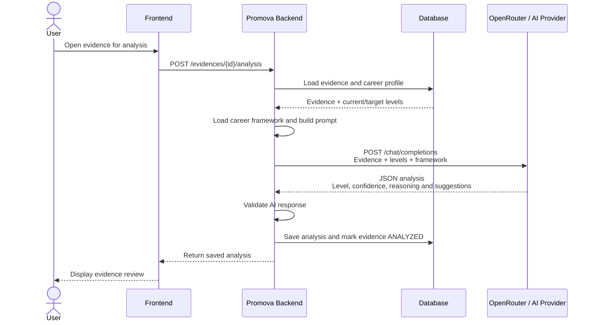

# Evidence AI Analysis Flow

```mermaid
sequenceDiagram
    actor User
    participant UI as Frontend
    participant API as Promova Backend
    participant DB as Database
    participant AI as OpenRouter / AI Provider

    User->>UI: Open evidence for analysis
    UI->>API: POST /evidences/{id}/analysis

    API->>DB: Load evidence and career profile
    DB-->>API: Evidence + current/target levels

    API->>API: Load career framework and build prompt

    API->>AI: POST /chat/completions<br/>Evidence + levels + framework
    AI-->>API: JSON analysis<br/>Level, confidence, reasoning and suggestions

    API->>API: Validate AI response
    API->>DB: Save analysis and mark evidence ANALYZED

    API-->>UI: Return saved analysis
    UI-->>User: Display evidence review
```

The AI provider request occurs when `PROMOVA_ANALYSIS_ENGINE=openrouter`. Otherwise, the backend uses the local mock engine.
